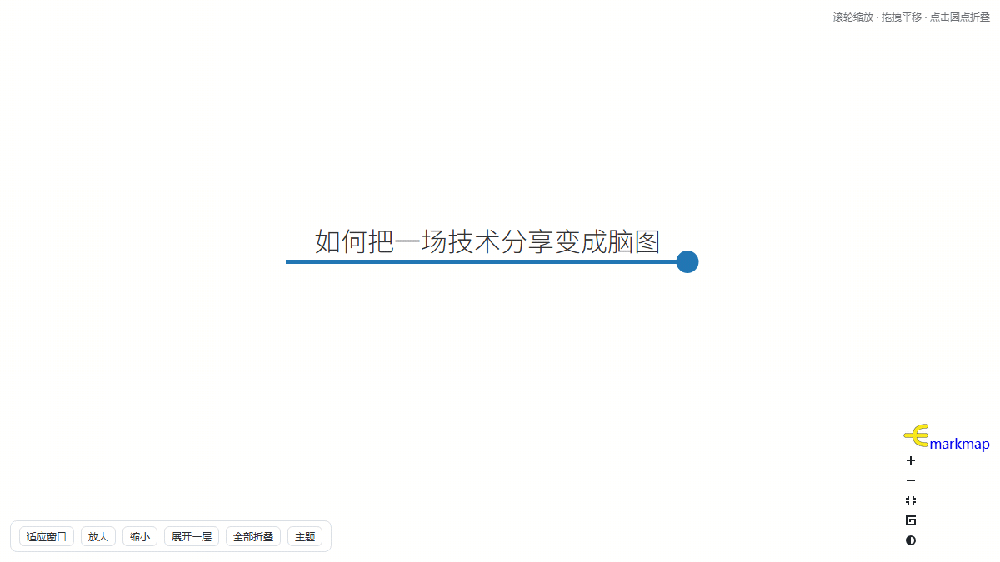

# vedio-concentrator

[](https://github.com/Edoardo-Zhang/vedio-concentrator/releases)
[](LICENSE)
[](https://www.python.org/downloads/)
[](#一安装)
[](https://github.com/yt-dlp/yt-dlp/blob/master/supportedsites.md)

> 给一个视频链接，自动**下载视频 → 提取字幕（没有就本地语音转写）→ 生成可交互的脑图**。



*一个 30 分钟的视频，压成一张可以点开细看的脑图。上图是逐层展开的实际效果。*

`vedio-concentrator` 是一个 Agent Skill（配合几个命令行脚本）。装好之后，在 Codex / DSH 这类支持 Skill 的
Agent 里直接说「把这个视频做成脑图 https://...」即可；也可以完全脱离 Agent，用命令行跑。

- **字幕优先**：平台有字幕就直接用（快且准），没有才调用本地语音识别
- **本地转写**：faster-whisper `medium` 中文模型，NVIDIA 显卡可跑，实测 **11~17 倍实时**
- **离线脑图**：markmap 渲染成单个 HTML 文件，可缩放/折叠/切主题，不联网也能看
- **多站点**：YouTube / B站 / 抖音 / 小红书 / X 等 yt-dlp 支持的站点

---

## 一、安装

### 前置要求

| 项目 | 要求 |
|---|---|
| 系统 | Windows 10 / 11（脚本按 Windows 路径写，思路可移植到 mac/Linux） |
| Python | **3.9 或更高**（[下载](https://www.python.org/downloads/)，安装时勾选 *Add python.exe to PATH*） |
| 磁盘 | 约 2 GB（其中 ASR 模型 1.5 GB） |
| 网络 | 首次安装需联网下载模型和 ffmpeg |
| 显卡 | 可选。有 NVIDIA 显卡会快 20 倍以上，没有就用 CPU（依然可用） |


### 方式 A：下载 zip 一键安装（推荐）

1. 到本仓库的 **[Releases](../../releases)** 页下载 `vedio-concentrator-bundle.zip`
   （源码树的 [`dist/`](dist/) 目录里也有同样两个包，可直接取用）
2. **完整解压**到任意目录（不要只解压一半，也不要在压缩包里直接双击）
3. 双击 **`install.cmd`**
4. 等它跑完（首次约 5~15 分钟，主要时间花在下载 1.5 GB 模型）

看到 `[5/5] 自检` 全绿、`安装完成` 就好了。

> 包内不带任何模型或二进制，安装时才按需下载，所以 zip 只有 40 KB 左右。

**两个包的区别**

| 包 | 结构 | 用途 |
|---|---|---|
| `vedio-concentrator-bundle.zip` | 顶层就是 `install.cmd` | **给用户下载**，双击即装 |
| `vedio-concentrator-repo.zip` | `scripts/` + `skill/` + `README` | 推 GitHub / 二次开发 |

安装脚本做的事：把 skill 装到 `%USERPROFILE%\.cursor\skills\vedio-concentrator\`，
把运行时（模型 + ffmpeg + 渲染库）装到 `%LOCALAPPDATA%\vedio-concentrator\`。

```powershell
# 可选参数
.\install.cmd -Dest "D:\my\skills"   # 换 skill 安装位置
.\install.cmd -SkipRuntime           # 只装 skill，不下载模型
.\install.cmd -Proxy http://127.0.0.1:7897   # 指定代理
```

**不想下载 zip？一行命令装（需要 PowerShell）：**

```powershell
$env:VC_REPO = "Edoardo-Zhang/vedio-concentrator"
irm https://raw.githubusercontent.com/Edoardo-Zhang/vedio-concentrator/main/scripts/bootstrap.ps1 | iex
```

`bootstrap.ps1` 会自动找最新 Release、下载、解压、调用 `install.ps1`。

### 方式 B：克隆仓库

```powershell
git clone https://github.com/Edoardo-Zhang/vedio-concentrator.git
cd vedio-concentrator\scripts
python setup.py            # 装 skill + 运行时
python setup.py --check    # 只自检
```

### 方式 C：自己打包分发

```powershell
cd scripts
python build_dist.py       # 产出 dist/*.zip 和 SHA256SUMS.txt
```

打包脚本会自动规范化编码，避免 Windows 上的两个经典坑：`.ps1` 带 UTF-8 BOM
（否则 PowerShell 5.1 按 ANSI 解析中文会报错）、`.cmd` 用 GBK + CRLF
（否则 cmd.exe 会把 `rem` 注释拆行执行）。

### 方式 D：自己发布到 GitHub

如果你是仓库维护者，想把项目发到 GitHub 并长期更新，见 **[GITHUB-GUIDE.md](GITHUB-GUIDE.md)**
——从建仓库、传代码、发 Release 到日常维护和故障排查，一步步写给新手看。

日常改动只需**双击仓库根目录的 `更新.cmd`**，它会自动完成：检查多份拷贝有没有分叉 →
打包 zip → 同步到你本机装的那份 → 提交并推送到 GitHub。

三份拷贝的关系、版本号规则、Release 流程见 **[维护必读.md](维护必读.md)**。

### 安装到哪了 / 怎么卸载

| 内容 | 位置 |
|---|---|
| Skill（文档 + 脚本） | `%USERPROFILE%\.cursor\skills\vedio-concentrator\` |
| 运行时（模型/ffmpeg/markmap） | `%LOCALAPPDATA%\vedio-concentrator\` |

卸载 = 删掉上面两个目录。想换盘：设环境变量 `VEDIO_CONCENTRATOR_HOME=D:\vedio` 后重跑安装脚本。

---

## 二、使用

### 在 Agent 里（推荐）

直接给链接说话就行：

> 帮我把这个视频做成脑图 https://www.bilibili.com/video/BVxxxxxxxx

Agent 会读 `SKILL.md`，按四步走：下载 → 拿转写稿 → 写大纲 → 渲染脑图。

### 命令行

```powershell
$S = "$env:USERPROFILE\.cursor\skills\vedio-concentrator\scripts"

# 1) 下载视频 + 抓字幕（无字幕会自动转写）
python "$S\v2mm.py" "<视频链接>" --outdir ".\out"

# 2) 没有字幕时，单独跑语音转写
python "$S\v2mm.py" --transcribe ".\out" --lang zh

# 3) 自己看一眼 .\out\transcript.txt，写一份 .\out\outline.md

# 4) 渲染成脑图
python "$S\render_mindmap.py" --md ".\out\outline.md" --out ".\out\mindmap.html"
```

产物（都在 `--outdir` 里）：

| 文件 | 说明 |
|---|---|
| `video.*` | 视频本体（`--audio-only` 时是音频） |
| `transcript.txt` | **主输入**：`[mm:ss] 文本` 逐行，已去重 |
| `transcript.srt` | 带时间码，可拖进播放器对照 |
| `meta.json` | 标题 / UP主 / 时长 / 播放量 / 简介 |
| `outline.md` | 你写的大纲 |
| `mindmap.html` | **交互式脑图**（单文件离线可用） |

### 常用参数

| 参数 | 什么时候用 |
|---|---|
| `--cookies-from-browser chrome` | B站要看 1080p、抖音/小红书要登录 |
| `--proxy http://127.0.0.1:7897` | YouTube 等墙外站点（脚本按域名自动判断） |
| `--audio-only` | 只要内容不要视频，省流量 |
| `--max-height 720` | 限制画质 |
| `--lang zh` | 强制中文字幕 / 强制中文识别 |
| `--prompt "关键词,关键词"` | 专有名词多的视频，能明显减少错字 |
| `--model <目录>` | 换用 large-v3 等更大的模型 |

完整参数见 [skill/reference.md](skill/reference.md)。

### 代理怎么配（不用改代码）

**默认不用管**。脚本会自动找代理：先读环境变量，没有就依次探测常见端口并**真发一次请求验证**
（端口开着不代表协议对），全部失败就走直连。

探测的端口：`7897` `7890`（Clash 系）、`10809` `10808`（v2rayN）、`1080` `2080` `20171` `8118` `8889`。
IPv4（`127.0.0.1`）和 IPv6（`::1`）都会测——Windows 上不少客户端只监听 `::`。

如果你的端口不在上面，或想固定用一个，**设一个环境变量就行**：

```powershell
# 只对当前窗口生效
$env:VEDIO_CONCENTRATOR_PROXY = "http://127.0.0.1:你的端口"

# 永久生效（推荐）
[Environment]::SetEnvironmentVariable("VEDIO_CONCENTRATOR_PROXY","http://127.0.0.1:你的端口","User")
```

也可以用 `HTTPS_PROXY` / `HTTP_PROXY`（很多工具共用这一套，脚本同样认）。
优先级：`VEDIO_CONCENTRATOR_PROXY` > `HTTPS_PROXY` > `HTTP_PROXY` > 自动探测。

**安装那一次**想指定代理，加参数即可：

```powershell
.\install.cmd -Proxy http://127.0.0.1:你的端口
```

> 注意 `-Proxy` 只影响安装过程。装完之后下载视频要用的代理，仍然靠上面那个环境变量或自动探测。

某个站点不想走代理，或者想强制指定，用命令行参数：

```powershell
python scripts\v2mm.py "<URL>" --no-proxy                                # 强制直连
python scripts\v2mm.py "<URL>" --proxy http://127.0.0.1:10809           # 强制指定
```

想看看探测到了什么：

```powershell
python -c "import sys;sys.path.insert(0,r'%USERPROFILE%\.cursor\skills\vedio-concentrator\scripts');import vcproxy;vcproxy.detect(verbose=True)"
```

---

## 三、排错

| 症状 | 原因 / 处理 |
|---|---|
| 双击 `install.cmd` 闪一下就没了 | 在 cmd 里手动执行它，就能看到完整报错 |
| `没找到 Python` | 装 Python 时没勾 *Add to PATH*，重装并勾上 |
| 安装时报“文件被其它程序占用” | 杀软正在扫描刚解压的文件。脚本会自动重试 8 次；仍失败就关掉杀软实时扫描后重装 |
| 中文显示成乱码 | `install.cmd` 被转存成了 UTF-8。转回 ANSI/GBK，或把里面的 `chcp 936` 改成 `chcp 65001` |
| `no video formats found` | 站点要登录：加 `--cookies-from-browser chrome` |
| `Sign in to confirm you're not a bot` | YouTube 需要 cookie：`--cookies-from-browser edge` |
| 模型下载中断 | **重跑安装脚本**，支持断点续传，不会从零开始 |
| 转写特别慢 | 没走 GPU。跑 `setup_check.py` 看 GPU 那行；CPU 也能用，就是慢一些 |
| 中文错字多 | 加 `--prompt "本视频关键词：xxx,yyy"` |
| 脑图打开一片空白 | 跑 `render_mindmap.py --selfcheck` 检查渲染库 |
| B站只有 360p | 不带 cookie 的正常限制，用 `--cookies-from-browser` |

---

## 四、说明

- **仅供个人学习使用**。下载他人视频请遵守对应平台的服务条款与著作权规定，不要二次分发。
- 本仓库**不包含**任何模型权重或视频内容。ASR 模型首次安装时从 hf-mirror / HuggingFace 下载
  （`Systran/faster-whisper-medium`），ffmpeg 来自 [GyanD/codexffmpeg](https://github.com/GyanD/codexffmpeg)，
  脑图库来自 npm 的 [markmap](https://github.com/markmap/markmap)。各组件版权归原作者所有。
- 平台规则会变，下载失败时**先升级 yt-dlp**：`python -m pip install -U yt-dlp`，这是最常见的一行修复。
- 微信视频号（WeChat Channels）yt-dlp 不支持，只能录屏或提供本地文件（`--local`）。

## 五、许可证

MIT，见 [LICENSE](LICENSE)。
